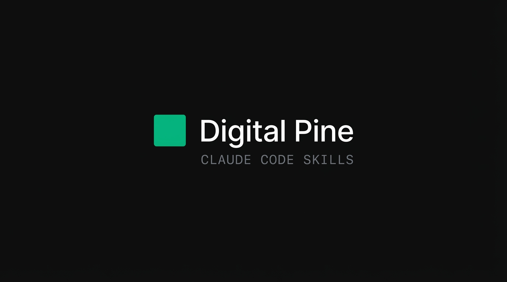

<p align="center">
  
</p>

<p align="center">
  <strong>Production-tested Claude Code plugins for framework setup, auditing, and modernization.</strong>
</p>

<p align="center">
  <a href="#quick-start">Quick Start</a> &nbsp;&middot;&nbsp;
  <a href="#plugins">Plugins</a> &nbsp;&middot;&nbsp;
  <a href="#what-are-skills">What Are Skills?</a>
</p>

---

## Quick Start

```
/plugin marketplace add DigitalPine/claude-skills
```

Then install what you need:

```
/plugin install biome@digitalpine
/plugin install vitest@digitalpine
/plugin install nextjs-16@digitalpine
/plugin install docker@digitalpine
/plugin install golang@digitalpine
```

That's it. Claude Code will automatically reference installed skills when they're relevant to your work.

## Plugins

### Biome

> Setup, configure, audit, and optimize Biome in JavaScript/TypeScript projects.

Covers installation with proper version pinning, migration from ESLint + Prettier, configuring "safe enough" unsafe fixes for development workflows, Next.js integration, VS Code editor setup, monorepo configuration, and a troubleshooting guide for common issues.

```
/plugin install biome@digitalpine
```

---

### Vitest

> Setup, configure, audit, and modernize Vitest testing for v4.0+.

Covers workspace configuration, Jest migration paths, browser mode testing, visual regression testing, coverage setup, CI integration, and performance optimization. Includes reference configs and migration guides.

**Includes:** 4 reference guides &middot; 6 config templates

```
/plugin install vitest@digitalpine
```

---

### Next.js 16

> The big one. Setup, configure, audit, and modernize Next.js 16 projects.

Covers Cache Components (`use cache` directive), proxy.ts authentication migration, async API changes, Turbopack adoption, Biome integration, shadcn/ui setup, Vercel feature flags implementation, and CLI reference. 1,100+ lines of guidance with full reference docs.

**Includes:** 6 reference guides &middot; 9 asset templates

```
/plugin install nextjs-16@digitalpine
```

---

### Docker

> Docker guidance that starts with "do you actually need a Dockerfile?"

Decision tree for when to use containers vs mounted code. When you do need Docker: multi-stage build patterns, security hardening, BuildKit optimization, and production-ready Dockerfiles for Node.js, Go, Python, and Next.js.

**Includes:** 5 reference guides &middot; 6 Dockerfile templates

```
/plugin install docker@digitalpine
```

---

### Go

> Setup, audit, and modernize Go projects with two tiers: quick start or production-ready.

Covers project structure, golangci-lint v2 configuration, testing patterns, error handling, CI setup, and Go 1.25 features. Includes ready-to-use Makefile, Taskfile, and linter configs.

**Includes:** 5 reference guides &middot; 4 config templates

```
/plugin install golang@digitalpine
```

## What Are Skills?

Skills are structured knowledge — not scripts, not automation. They're expert-level guidance that Claude Code loads into context when relevant.

When you install the `biome` skill and then ask Claude to set up linting in your project, it doesn't just guess. It knows about version pinning with `-E`, the safe/unsafe fix distinction, which rules to override for development workflows, and how to disable ESLint in Next.js builds. That knowledge came from configuring Biome across dozens of real projects.

Every skill in this marketplace was extracted from patterns we use daily. They encode the decisions you'd make after reading the docs three times, hitting the edge cases, and figuring out what actually works.

## About

Built by [Digital Pine](https://github.com/DigitalPine). We ship developer tools and infrastructure, and these skills are how we work.

## License

MIT
